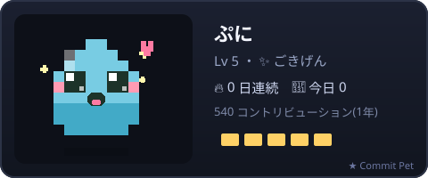
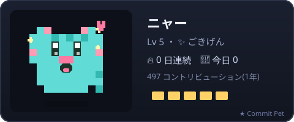
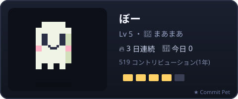
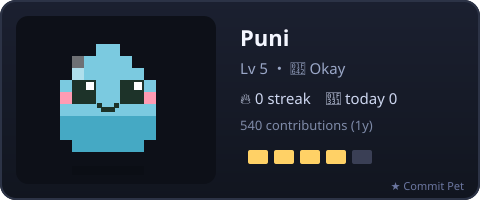
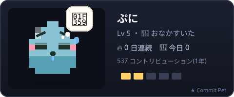
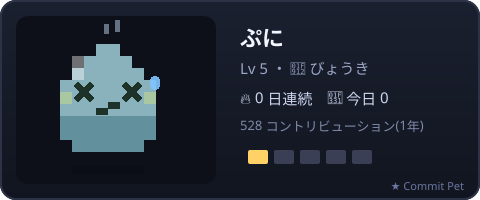

# 🐾 Commit Pet

[English](README.md) | **日本語**

> GitHub のプロフィール README に住むドットのペット。あなたのコミットに合わせて育ちます。
> こまめにコミットしているとごきげん。数日さわらないとおなかをすかせ、放っておくと寝込んでしまいます。

<p align="center">
  
</p>

Commit Pet は**あなた自身のリポジトリの GitHub Actions** で動きます。処理はあなたの Actions 時間で完結するため、
何人が使っても誰のコストも増えません。各カードには小さな `★ Commit Pet` リンクが付いています。

---

## できること

- **3種類のペット** — スライム・ねこ・おばけ。好きな子を1匹選びます。
- **きぶんが変わる** — 最後にコミットしてからの日数で `ごきげん → まあまあ → おなかすいた → びょうき` と表情が変化します。
- **レベルと連続記録** — 総コントリビューションでレベルが上がり、連続コミット日数も表示します。
- **自分だけの色** — 色はユーザー名から決まるので、同じ見た目の子はいません。
- **SVGだけで動く** — README の中でぷるぷる揺れて瞬きします。JavaScript は不要です。
- **AIが日記を書く** — 更新PRには、無料の [GitHub Models](https://github.com/marketplace/models) でペットが書いた一言日記が付きます。
- **更新はプルリクで届く** — 中身を確認してからマージできます（自動マージも可）。
- **依存ゼロ** — Node 20 の標準ライブラリだけ。

## ギャラリー

| スライム | ねこ | おばけ |
|:---:|:---:|:---:|
|  |  |  |

きぶんごとに見た目がはっきり違うので、ひと目で状態がわかります。

| ごきげん | まあまあ | おなかすいた | びょうき |
|:---:|:---:|:---:|:---:|
|  |  |  |  |

## 使い方

**はじめる前に**

1. **プロフィールリポジトリ**（ユーザー名と同じ名前のリポジトリ。例: `your-name/your-name`）を用意します。[作り方はこちら。](https://docs.github.com/ja/account-and-profile/setting-up-and-managing-your-github-profile/customizing-your-profile/managing-your-profile-readme)
2. そのリポジトリの **Settings → Actions → General → Workflow permissions** を開き、**「Allow GitHub Actions to create and approve pull requests」** を ON にします。これを忘れると、実行時に *「GitHub Actions is not permitted to create or approve pull requests.」* で失敗します。

> 以下のコマンドは [GitHub CLI](https://cli.github.com/)（`gh`）を使います。先に `gh auth login` を一度実行し、`your-name` は自分のユーザー名に置き換えてください。

### 1. ワークフローを置く

プロフィールリポジトリを clone して `.github/workflows/commit-pet.yml` を作ります。`species`・`name`・`theme` はお好みで変えてOK（一覧は[カスタマイズできる項目](#カスタマイズできる項目)）。

<details open><summary><b>Windows（PowerShell）</b></summary>

```powershell
gh repo clone your-name/your-name
cd your-name
New-Item -ItemType Directory -Force -Path .github/workflows | Out-Null
@'
name: Commit Pet
on:
  schedule:
    - cron: "0 21 * * *"
  workflow_dispatch:
permissions:
  contents: write
  pull-requests: write
  models: read
jobs:
  pet:
    runs-on: ubuntu-latest
    steps:
      - uses: actions/checkout@v4
      - uses: yukurash/commit-pet@v1
        with:
          species: slime          # slime | cat | ghost
          name: ぷに              # ペットの名前
          output: commit-pet.svg
          theme: jp               # en | jp
'@ | Set-Content .github/workflows/commit-pet.yml -Encoding utf8
git add .github/workflows/commit-pet.yml
git commit -m "Add Commit Pet workflow"
git push
```

</details>

<details><summary><b>macOS / Linux（bash）</b></summary>

```bash
gh repo clone your-name/your-name
cd your-name
mkdir -p .github/workflows
cat > .github/workflows/commit-pet.yml <<'YAML'
name: Commit Pet
on:
  schedule:
    - cron: "0 21 * * *"
  workflow_dispatch:
permissions:
  contents: write
  pull-requests: write
  models: read
jobs:
  pet:
    runs-on: ubuntu-latest
    steps:
      - uses: actions/checkout@v4
      - uses: yukurash/commit-pet@v1
        with:
          species: slime          # slime | cat | ghost
          name: ぷに              # ペットの名前
          output: commit-pet.svg
          theme: jp               # en | jp
YAML
git add .github/workflows/commit-pet.yml
git commit -m "Add Commit Pet workflow"
git push
```

</details>

✅ **OK の合図**: `git push` が成功し、リポジトリの **Actions** タブに **Commit Pet** というワークフローが表示されたら完了です。

### 2. 一度だけ実行する

ワークフローを実行し、完了を待ってから、作られたプルリクをマージします:

```bash
gh workflow run commit-pet.yml
gh run watch                                   # 実行が終わるまで待つ
gh pr list                                     # 「Commit Pet update」PR の番号を確認
gh pr merge <番号> --squash --delete-branch     # マージ
```

クリック操作が好みなら: **Actions** タブ → **Commit Pet** → **Run workflow** を押し、**Pull requests** タブから PR をマージします。

✅ **OK の合図**: PR がマージされ、`output` のパス（既定 `commit-pet.svg`）がリポジトリに出来ていれば完了です。

### 3. README に表示する

マージ済みの画像を取り込み、プロフィールの `README.md` に1行追記して push します:

<details open><summary><b>Windows（PowerShell）</b></summary>

```powershell
git pull
Add-Content README.md "`n"
git commit -am "Show Commit Pet on my profile"
git push
```

</details>

<details><summary><b>macOS / Linux（bash）</b></summary>

```bash
git pull
printf '\n\n' >> README.md
git commit -am "Show Commit Pet on my profile"
git push
```

</details>

✅ **OK の合図**: `https://github.com/your-name` を開いてプロフィール最下部にペットが出ていれば完了。あとは毎日のスケジュールが、プルリク経由でペットを更新し続けます。

## カスタマイズできる項目

ワークフローの `with:`（ステップ1）に書く設定です:

| 項目 | 既定値 | 役割 |
|---|---|---|
| `species` | `slime` | キャラを選ぶ: `slime` \| `cat` \| `ghost`。 |
| `name` | — | カードに表示する名前。 |
| `theme` | `en` | カードの言語: `en` \| `jp`。日本語表記は `jp`。 |
| `output` | `commit-pet.svg` | SVG の出力先。README でも同じパスを指定します。 |
| `username` | リポジトリ所有者 | コントリビューションを読むユーザー。 |
| `pr_branch` | `commit-pet/update` | 更新PRに使うブランチ名。 |
| `auto_merge` | `false` | `true` で自動マージ（リポジトリの自動マージ有効が前提）。 |
| `token` | `github.token` | `contents:write`・`pull-requests:write`・`models:read` が必要。 |

## しくみ

```
GitHub GraphQL ─▶ コントリビューションカレンダー ─▶ ステータス(レベル/きぶん/連続)
                                              │
                                  ドットSVG + AI日記 (GitHub Models)
                                              │
                              peter-evans/create-pull-request ─▶ あなたのPR
```

すべてあなたのリポジトリの Actions 時間で動きます。カードの `★ Commit Pet` フッターはこのプロジェクトにリンクしています。

## ローカルで試す

```bash
node src/generate.js --demo --user yourname --species cat --name ニャー --theme jp --out pet.svg
```

`--demo` は内蔵のオフラインカレンダーを使うのでトークンは不要です。`--demo` を外して `--token`
（または `GITHUB_TOKEN`）を渡すと、実際のコントリビューションから描画します。

## ライセンス

MIT © yukurash
