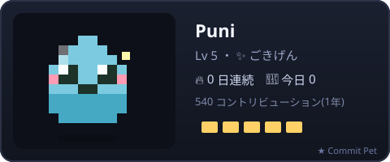
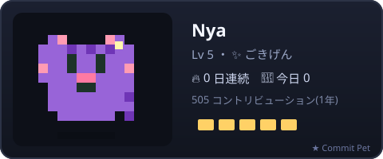
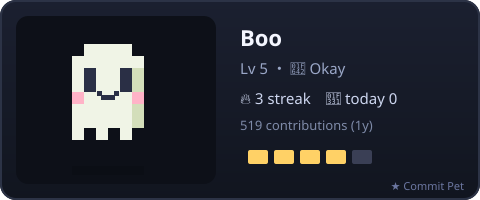
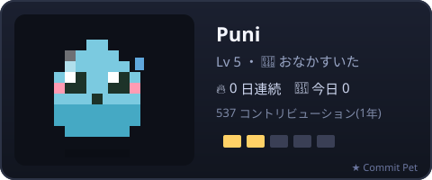
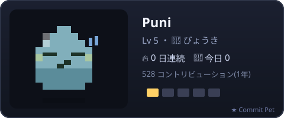

# 🐾 Commit Pet

**English** | [日本語](README.ja.md)

> A tiny **pixel pet** that lives in your GitHub profile README and grows with your commits.
> Commit every day to keep it happy — skip a few days and it gets hungry, then sick. 🥲

<p align="center">
  
</p>

It runs as a **GitHub Action inside your own repo**, so it costs *you* (the author) nothing and scales forever.
Each card links back here — if your pet makes someone smile, that's a ⭐ for the project.

---

## ✨ Features

- **3 species** — 🟢 slime / 🐱 cat / 👻 ghost. Pick your buddy.
- **Mood system** — `ごきげん → まあまあ → おなかすいた → びょうき` based on how recently you committed.
- **Levels & streaks** — your pet levels up with total contributions and tracks your 🔥 streak.
- **Unique color** — derived from your username, so everyone's pet looks a little different.
- **Pure pixel SVG + SMIL** — bobs and blinks right inside the README (no JS needed).
- **AI diary** — each update PR includes a one-line diary your pet "writes" via free [GitHub Models](https://github.com/marketplace/models).
- **PR-based** — updates arrive as a pull request you can review (or auto-merge).
- **Zero dependencies** — pure Node 20 standard library.

## 🎀 Gallery

| slime | cat | ghost |
|:---:|:---:|:---:|
|  |  |  |

| happy | hungry | sick |
|:---:|:---:|:---:|
|  |  |  |

## 🚀 Quick start

1. Open your **profile repo** (`<your-username>/<your-username>`). [What's that?](https://docs.github.com/en/account-and-profile/setting-up-and-managing-your-github-profile/customizing-your-profile/managing-your-profile-readme)
2. Add this workflow at `.github/workflows/commit-pet.yml`:

```yaml
name: Commit Pet

on:
  schedule:
    - cron: '0 21 * * *'   # daily
  workflow_dispatch:

permissions:
  contents: write
  pull-requests: write
  models: read              # enables the AI diary (optional)

jobs:
  pet:
    runs-on: ubuntu-latest
    steps:
      - uses: actions/checkout@v4
      - uses: yukurash/commit-pet@v1
        with:
          species: slime     # slime | cat | ghost
          name: Puni
          output: commit-pet.svg
          theme: en          # en | jp
```

3. Add the image to your `README.md`:

```markdown

```

4. Run the workflow once (**Actions → Commit Pet → Run workflow**). It opens a PR with your pet — merge it and you're done. 🎉

## ⚙️ Inputs

| Input | Default | Description |
|---|---|---|
| `username` | repo owner | Whose contributions to read. |
| `species` | `slime` | `slime` \| `cat` \| `ghost`. |
| `name` | — | Name shown on the card. |
| `output` | `commit-pet.svg` | SVG path committed to your repo. |
| `theme` | `en` | `en` \| `jp`. |
| `pr_branch` | `commit-pet/update` | Branch used for the update PR. |
| `auto_merge` | `false` | `true` to auto-merge (needs repo auto-merge enabled). |
| `token` | `github.token` | Needs `contents:write`, `pull-requests:write`, `models:read`. |

## 🧠 How it works

```
GitHub GraphQL ─▶ contribution calendar ─▶ stats (level / mood / streak)
                                              │
                                  pixel SVG + AI diary (GitHub Models)
                                              │
                              peter-evans/create-pull-request ─▶ your PR
```

Everything runs in *your* repo's Actions minutes. The pet's `★ Commit Pet` footer links back to this project.

## 🛠️ Local preview

```bash
node src/generate.js --demo --user yourname --species cat --name Nya --out pet.svg
```

`--demo` uses a deterministic offline calendar — no token needed. Drop `--demo` and pass `--token` (or set `GITHUB_TOKEN`) for live data.

## 📄 License

MIT © yukurash
