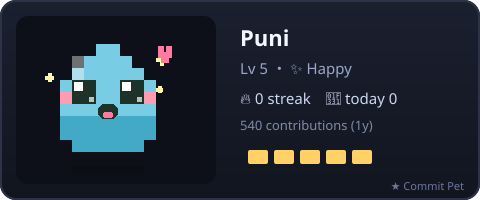
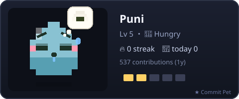
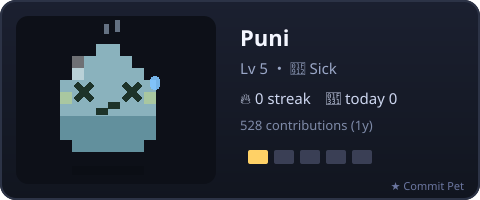

# 🐾 Commit Pet

**English** | [日本語](README.ja.md)

> A pixel pet that lives in your GitHub profile README and grows with your commits.
> Commit often and it stays happy. Go quiet for a few days and it gets hungry, then sick.

<p align="center">
  
</p>

Commit Pet runs as a GitHub Action **inside your own repository**. The compute uses your own
Actions minutes, so it scales to any number of users at no cost to anyone. Every card carries a
small `★ Commit Pet` link back here.

---

## Features

- **Three species** — slime, cat, and ghost. Pick one.
- **Mood system** — `happy → content → hungry → sick`, based on how recently you committed.
- **Levels and streaks** — your pet levels up from total contributions and tracks your commit streak.
- **A color that's yours** — the palette is derived from your username, so no two pets look the same.
- **Pure SVG animation** — the pet bobs, blinks, and reacts right inside the README. No JavaScript needed.
- **AI diary** — every update PR includes a one-line diary your pet "writes" with free [GitHub Models](https://github.com/marketplace/models).
- **Review by pull request** — updates arrive as a PR you can read and merge (or auto-merge).
- **Zero dependencies** — plain Node 20, nothing to install.

## Gallery

| slime | cat | ghost |
|:---:|:---:|:---:|
|  |  |  |

Each mood looks clearly different, so you can read your pet's state at a glance:

| happy | content | hungry | sick |
|:---:|:---:|:---:|:---:|
|  |  |  |  |

## Setup

You need a **profile repository** — a repo named exactly like your username (for example
`yukurash/yukurash`). [How to create one.](https://docs.github.com/en/account-and-profile/setting-up-and-managing-your-github-profile/customizing-your-profile/managing-your-profile-readme)

**Step 1 — Add the workflow.**
Copy [examples/commit-pet.yml](examples/commit-pet.yml) into your profile repo at
`.github/workflows/commit-pet.yml`, then adjust `species`, `name`, and `theme` to taste. That one
file is all you add — the Action itself lives here and is pulled in automatically.

**Step 2 — Run it once.**
Open the **Actions** tab in your repo, select **Commit Pet**, and click **Run workflow**. It
renders your pet and opens a pull request. Merge that PR.

After merging, the image exists in your repo at the path you set in `output` (default
`commit-pet.svg`).

**Step 3 — Show the pet in your README.**
Add one line to your profile `README.md`, pointing at that same path:

```markdown

```

From then on, the daily schedule keeps your pet up to date through pull requests.

## Inputs

| Input | Default | Description |
|---|---|---|
| `species` | `slime` | `slime` \| `cat` \| `ghost`. |
| `name` | — | Name shown on the card. |
| `output` | `commit-pet.svg` | Where the SVG is written. Use the same path in your README. |
| `theme` | `en` | `en` \| `jp`. |
| `username` | repo owner | Whose contributions to read. |
| `pr_branch` | `commit-pet/update` | Branch used for the update PR. |
| `auto_merge` | `false` | `true` to auto-merge (your repo must allow auto-merge). |
| `token` | `github.token` | Needs `contents:write`, `pull-requests:write`, `models:read`. |

## How it works

```
GitHub GraphQL ─▶ contribution calendar ─▶ stats (level / mood / streak)
                                              │
                                  pixel SVG + AI diary (GitHub Models)
                                              │
                              peter-evans/create-pull-request ─▶ your PR
```

Everything runs in your repository's own Actions minutes. The `★ Commit Pet` footer on each card
links back to this project.

## Local preview

```bash
node src/generate.js --demo --user yourname --species cat --name Nya --out pet.svg
```

`--demo` uses a built-in offline calendar, so no token is needed. Drop `--demo` and pass `--token`
(or set `GITHUB_TOKEN`) to render from live data.

## License

MIT © yukurash
